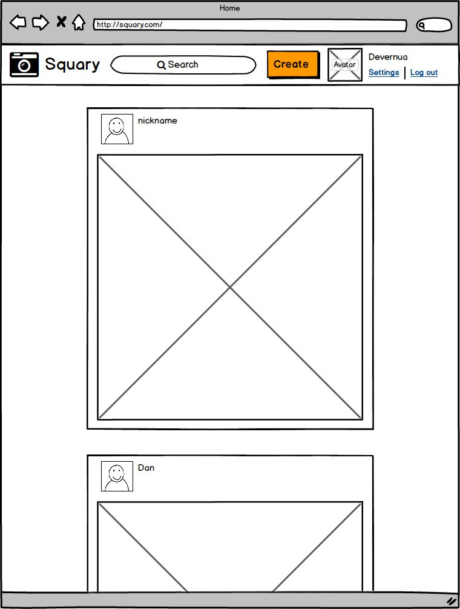

# Squary
photo from photos

Проект “Squary”. Это сервис, который позволяет пользователям делиться фотографиями, обработанными специальными фильтрами. Возможности комментирования и голосования позволяет составить рейтинг фотографий.

### Используемые технологии
Код приложения пишется на python/django, приложение запускается под управлением сервера gunicorn. База данных – mysql. Для отдачи статики используется nginx. Для полнотекстового поиска - используется sphinx. Для кеширования данных - memcached. Верстка выполняется с использованием twitter bootstrap. Взаимодействие интерфейса с пользователем обеспечивается javascript/jquery. Для авторизации и хранения пользователей - приложение django.contrib.auth. Для реализации фильтров используется база данных tarantool.

### Основные сущности
1. Пользователь – электронная почта, никнейм, пароль, аватарка, дата регистрации, галерея, подписчики, подписки.
2. Галерея - набор картинок пользователя.
3. Картинка – название, изображение, автор, дата создания, рейтинг.
4. Комментарий – содержание, автор, дата написания.

### Основные страницы и формы
Лента изображений с пагинацией по 10 штук  с возможностью подгрузки продолжение на странице с сортировкой по дате добавления и рейтингу (2 вида сортировки). В шапке сайта находятся: логотип, поисковая строка (для быстрого поиска по названиям), кнопка выложить изображение (доступна только авторизованным). В правой части шапки - юзерблок. Для авторизованного пользователя юзерблок содержит его ник, аватарку, ссылки на “выход” и на страницу с его профилем. Для неавторизованных - ссылки “войти” и “регистрация”. Во всех листингах присутствуют кнопки “лайк/дизлайк”, позволяющие менять рейтинг изображения.

Страница добавления изображения (можно сделать оверлеем). Доступна только для авторизованных пользователей. В форму вводится название и путь до изображения, а также выбранный фильтр. При обработке формы обязательно проверка валидности данных. Если изображение успешно добавлено - пользователя перебрасывает главную страницу.

Страница изображения со списком комментариев. На странице изображения можно добавить комментарий. Форма добавления комментария находится на странице изображения. Отображается только для авторизованных пользователей. Пользователи могут голосовать за изображение с помощью лайков «+». Один пользователь может голосовать за 1 изображение только 1 раз, однако может отменить свой выбор или переголосовать неограниченное число раз.

Страница пользователя содержит его галерею. Каждый пользователь может смотреть страницу другого пользователя.

Форма авторизации. Состоит из поля логин и пароль. Дополнительно есть ссылка на форму регистрации. При успешной авторизации пользователь перебрасывается на исходную страницу, при неуспешной авторизации - ему показывается ошибка. Для авторизованных пользователей вместо этой формы должна показываться кнопка “Выйти”.

Страница регистрации. Любой пользователь может зарегистрироваться на сайте, заполнив форму с электронной почтой, никнеймом, аватаркой и паролем. Аватарка загружается на сервер и отображается рядом с изображениями пользователя.

